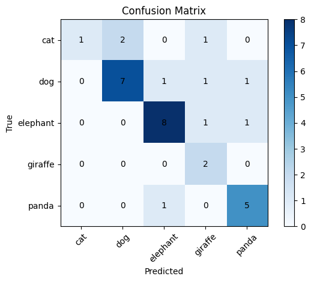
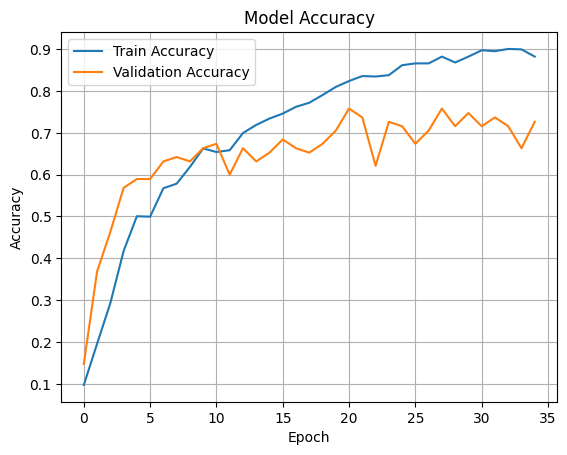
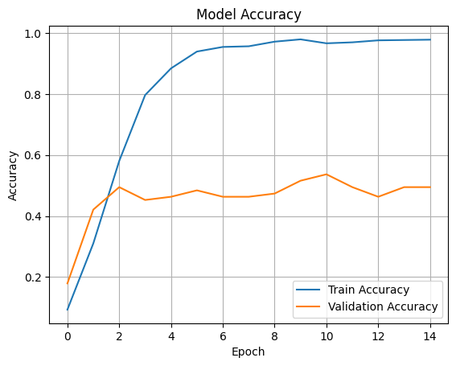
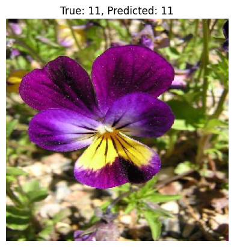

# Flower and Animal Image Classification using CNN

## Table of Contents

* [About](#about)
* [Getting Started](#getting-started)
* [Usage](#usage)

---

## About <a name="about"></a>

This repository contains three separate convolutional neural network (CNN) classification models implemented in Keras/TensorFlow:

1. **5 Animal Classification with Augmentation**
2. **17 Flower Classification with Augmentation**
3. **17 Flower Classification (No Augmentation)**

Each model trains on a separate dataset and evaluates performance using metrics such as accuracy, loss, and confusion matrix.

## Getting Started <a name="getting-started"></a>

### Installation

Clone the repository and install dependencies:

```bash
pip install -r requirements.txt
```

### Dataset

* 5 Animal Dataset (organized in one folder for both training/validation)
* 17 Flower Dataset (organized in `/train` and `/test` folders)

Datasets are mounted using Google Drive paths (e.g., `/content/drive/MyDrive/17Flower/`).

---

## Usage <a name="usage"></a>

### 1. 5 Animal Classification (with augmentation)

```bash
jupyter nbconvert --to script animal_model_augmented.ipynb
```

### 2. 17 Flower Classification (with augmentation)

```bash
jupyter nbconvert --to script flower_model_augmented.ipynb
```

### 3. 17 Flower Classification (no augmentation)

```bash
jupyter nbconvert --to script flower_model_simple.ipynb
```

Each script:

* Trains a CNN with early stopping
* Evaluates performance
* Generates:

  * Confusion matrix
  * Accuracy & loss plots over epochs

### Metrics Output

| Model                                     | Accuracy | Loss | val Accuracy | Val Loss | test Accuracy | test Loss |
|-------------------------------------------|----------|--------|----------|--------|----------|--------|
| 5 Animal Classification (Augmented)       | 0.83     | 0.42 | 0.65     | 1.00   | X.XX     | X.XX   |
| 17 Flower Classification (Augmented)      | 0.88     | 0.33 | 0.72     | 0.83   | 0.69     | 1.20   |
| 17 Flower Classification (No Augmentation)| 0.97     | 0.07 | 0.49     | 2.21   | 0.42     | 2.61   |

---

## Sample Outputs

* **5 Animal Classification (Augmented)**: Confusion matrix from `5animal_model_augmented.ipynb`



* **17 Flower Classification (Augmented)**: Accuracy plot from `17flower_model_augmented.ipynb`



* **17 Flower Classification (No Augmentation)**: Accuracy plot and sample prediction from `17flower_model_simple.ipynb`



