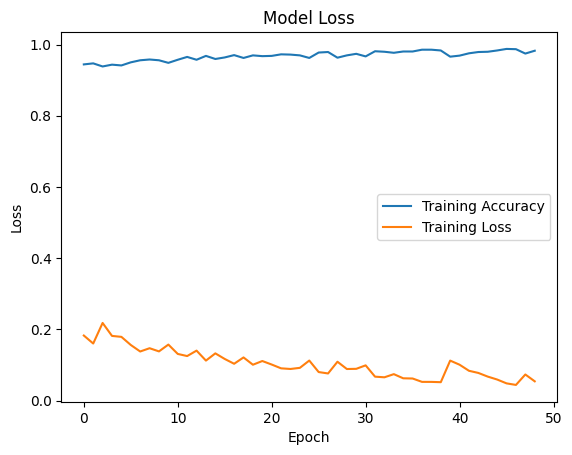

# Face Recognition

## Table of Contents

- [About](#about)
- [Getting Started](#getting-started)
- [Usage](#usage)

## About <a name="about"></a>

In this section, I have implemented the Face Recognition DNN algorithm on PersianFace dataset.

### face recognition

Model loss and Accuracy



## Getting Started <a name="getting-started"></a>

### Installation

To begin, install the required libraries by running the following command in your terminal:

```bash
pip install -r requirements.txt
```

## Usage <a name = "usage"></a>

If the requirements are installed, choose a project and run it.

### Run face recognition

``` terminal
jupyter nbconvert --to script face_recognition.ipynb
```
