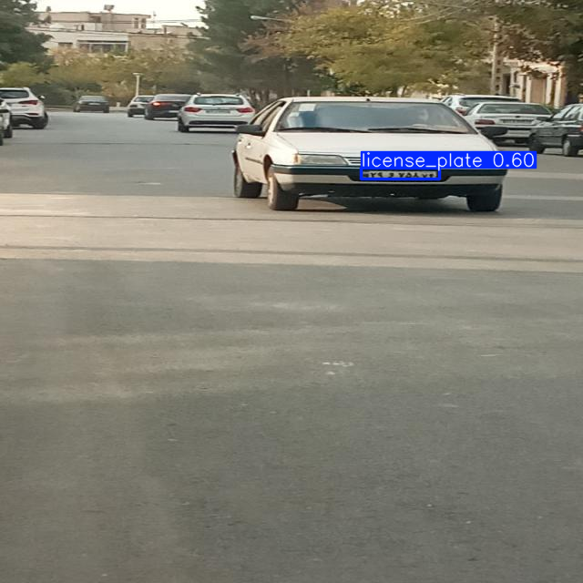

# Persian License Plate Detection

This project demonstrates how to train and evaluate a YOLO11n object detection model for Persian license plate detection using the [Roboflow](https://roboflow.com/) dataset and the [Ultralytics YOLO](https://docs.ultralytics.com/) library.

## Table of Contents

- [Overview](#overview)
- [Dataset](#dataset)
- [Setup](#setup)
- [Training](#training)
- [Evaluation](#evaluation)
- [Inference](#inference)
- [Results](#results)
- [References](#references)

## Overview

The notebook [`persian_license_plate_detection.ipynb`](persian_license_plate_detection.ipynb) covers:

- Downloading the Persian license plate dataset from Roboflow
- Training a YOLO11n model on the dataset
- Evaluating the model on validation and test sets
- Running inference on a sample image

## Dataset

- **Source:** Roboflow ([project link](https://universe.roboflow.com/sajjad-aemmi/persian-license-plate-detection))
- **Format:** YOLO11n
- **Classes:** License plates in Persian vehicles

## Setup

1. **Install dependencies:**

    ```bash
    pip install ultralytics roboflow
    ```

2. **Download the dataset:**

    The notebook uses the Roboflow API to download the dataset. You need a Roboflow API key.

## Training

The model is trained using the following configuration:

- **Model:** YOLO11n
- **Epochs:** 50
- **Image size:** 256x256
- **Batch size:** 4
- **Caching:** Enabled

## Evaluation

After training, the model is evaluated on both validation and test splits:

```python
val_results = model.val()
test_results = model.val(data='/content/Persian-License-Plate-Detection-7/data.yaml', split='test')
```

## Inference

Run inference on a sample image and visualize the results:

```python
test_image = '/content/Persian-License-Plate-Detection-7/images/test/photo_2023-11-07_14-34-47_jpg.rf.bcd55d35872394242ddd40645d7294cb.jpg'
inference_results = model(test_image)
inference_results[0].show()
```

## Results

| Split        | Precision | Recall | mAP50 | mAP50-95 |
|--------------|-----------|--------|-------|----------|
| Validation   | 0.739     | 0.455  | 0.500 | 0.227    |
| Test         | 0.663     | 0.345  | 0.346 | 0.155    |

- Example inference results are displayed for a test image.


## References

- [Ultralytics YOLO Documentation](https://docs.ultralytics.com/)
- [Roboflow Documentation](https://docs.roboflow.com/)
- [Roboflow Persian License Plate Detection Project](https://universe.roboflow.com/sajjad-aemmi/persian-license-plate-detection)
