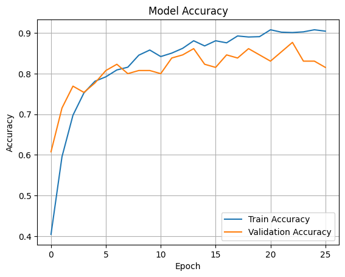
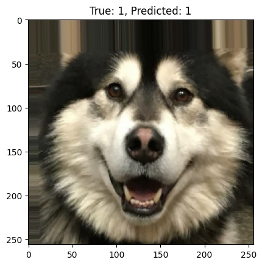
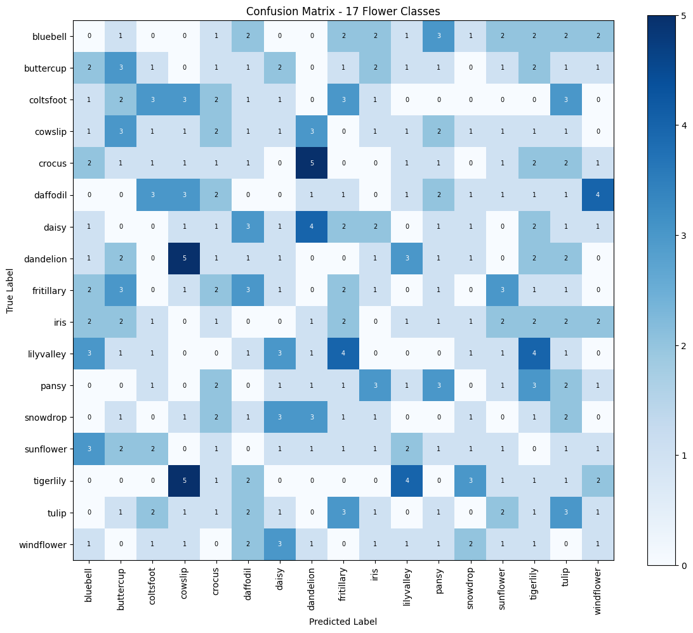
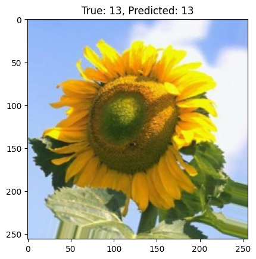
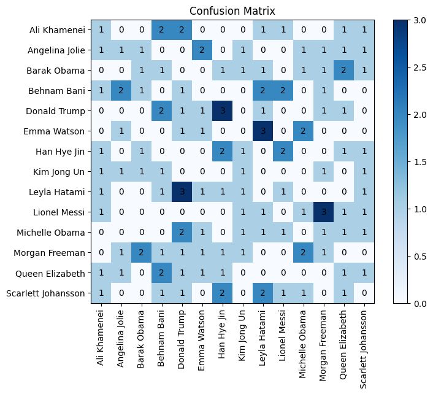
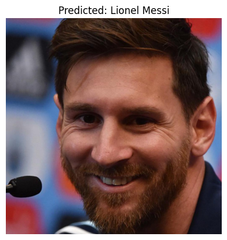
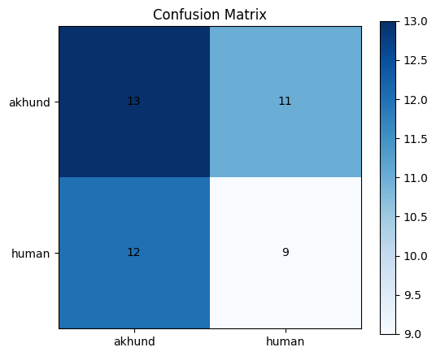

# Transfer Learning

## 1. Animals Classification

**Description:**  
A multi-class image classification task for identifying 5 different animals. The model is trained using Transfer Learning from a pre-trained CNN VGG16. The dataset contains high-quality labeled images for each animal class.

**Approach:**

- Transfer Learning using VGG16
- Fine-tuning last layers for improved accuracy
- Performance comparison with baseline

**Results:**


| Model                                     | Accuracy | Loss | val Accuracy | Val Loss |
|-------------------------------------------|----------|--------|----------|--------|
| 5 Animal Classification       | 0.83     | 0.42 | 0.65     | 1.00   |
| 5 Animal Classification(transfer learning)       | 0.89     | 0.26 | 0.81     | 0.45   |

**Sample Predictions:**
  

---

## 2. Flowers Classification

**Description:**  
A multi-class classification problem for recognizing 17 flower species. Transfer Learning is used to leverage pre-trained features and adapt them to flower recognition.

**Approach:**

- Transfer Learning using VGG16
- Fine-tuning for improved flower recognition
- Performance comparison with baseline

**Results:**

  

| Model                                     | Accuracy | Loss | val Accuracy | Val Loss |
|-------------------------------------------|----------|--------|----------|--------|
| 17 Flower Classification    | 0.88     | 0.33 | 0.72     | 0.83   |
| 17 flowers Classification(transfer learning)       | 0.87     | 0.47 | 0.90     | 0.45   |

**Sample Predictions:**
  

---

## 3. Faces Classification (7-7 Faces)

**Description:**  
Classifies faces from the "7-7 Faces" dataset. Transfer Learning is applied to a CNN model, and final evaluation is done with confusion matrix and sample predictions.

**Approach:**

- Transfer Learning using VGG16
- Face preprocessing and alignment
- Confusion matrix for class performance analysis
- Inference function for single image prediction

**Results:**
  

**Sample Predictions:**
  

**Inference Example:**

```python
# Example usage
prediction = inference("write your path of the image in here")
print("Predicted class:", prediction)
```

---

## 4. Akhund and Human Classification

**Description:**
Binary classification to distinguish between "Akhund" and "Human". The model is trained using Transfer Learning with dropout and partial layer freezing.

**Approach:**

- Transfer Learning using MobileNetV2
- Confusion matrix for performance evaluation

**Results:**

